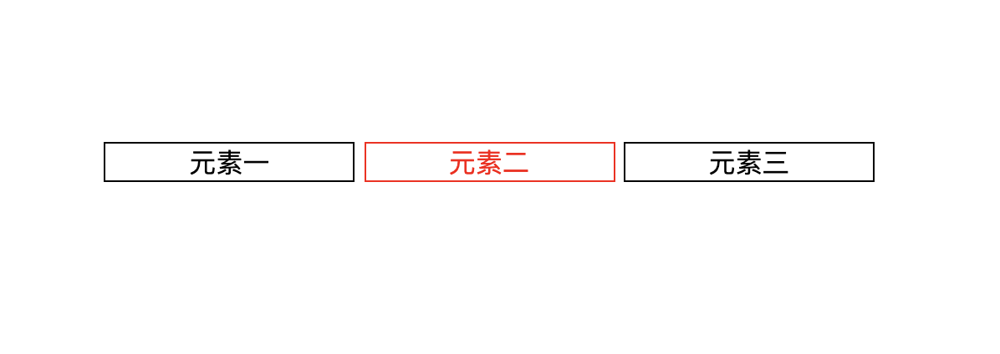

# 插件

<font size=5> ccmap 插件 </font>

### 介绍

当网页有元素切换的业务需求时，推荐开发者使用该插件: `ccmap.js`。

使用电视端网页与移动端、PC端网页最大的不同就是交互方式，电视端使用遥控器来操作，如何方便让网页元素之间焦点切换变得非常重要，`ccmap.js` 应此需求而生，它可以方便控制网页元素之间的切换。

::: tip 
不推荐开发者使用 `button、input` 等标签作为落焦元素，尽管浏览器内核会自动寻址这些标签元素，但不利于控制。
:::

<br/>

### 安装与环境依赖

直接下载并用`<script>`标签引入，[开发版本链接](https://beta.webapp.skysrt.com/fyb/other/cdn/ccmap-2.1.js)， ccmap会被注册为一个全局变量。


在开始使用`ccmap.js`之前，请确保先引入`jquery`：[下载链接](http://jquery.com/download/)。

<br/>
<br/>
<br/>
<br/>
<br/>
<br/>

<Block>

<font size=5> 快速使用 </font>

`ccmap插件`特点：
- 会被注册为一个全局单例对象
- 支持链式调用，使用方便
- 将一个或一组目标标签模拟成可落焦元素，常使用`<div>`标签

</Block>

<Block>
__初始化: ccmap.init(目标元素, 落焦元素, 落焦样式)__

```html
<div id="container">
	<div id="first" class="coocaa_btn">元素一</div>
	<div id="second" class="coocaa_btn">元素二</div>
	<div id="third" class="coocaa_btn">元素三</div>
</div>
```
```js
ccmap.init(".coocaa_btn", '#second', "btn_class");
```
```css
.btn-focus {
  border: 1px solid red;
  color: red;
}
```

<Example>
<br/>
<br/>
<br/>
<br/>
效果：

<!--  -->


</Example>

</Block>

1.初始化

2.重设一组焦点元素

3.添加/删除焦点元素

4.设置目标元素落焦|设置指定元素逻辑

5.监听/触发点击事件

6.监听按键事件

7.后续：模拟数字按键输入


<br/>
<br/>
<br/>
<br/>
<br/>


## 在线运行

## js-sdk与Vue

## ccmap与Vue

<br/>
<br/>
<br/>
<br/>
<br/>


<Block>

## CURL 组件

`CURL` 组件是一个非常有用的组件。主要用于在编写 API 时更好的显示 `curl` 命令时使用。

例如下面的内容将会渲染成右侧的形式：

````vue
<CURL>
```bash
curl -X POST http://api.example.com/api/auth/login \
  --data '{
    "username": "my-username",
    "password": "my-password"
  }'
```
</CURL>
````

`CURL` 组件会在组件下方自动生成一个按钮，当点击按钮时，会通过分析 `curl` 命令内的参数，通过 `JS` 发送请求到对应的地址上。并将其请求信息输出到浏览器开发者工具中的控制台上。方便进行快速测试和预览。

<Example>

<CURL>

```bash
curl -X POST http://api.example.com/api/auth/login \
  --data '{
    "username": "my-username",
    "password": "my-password"
  }'
```
</CURL>

</Example>

</Block>

