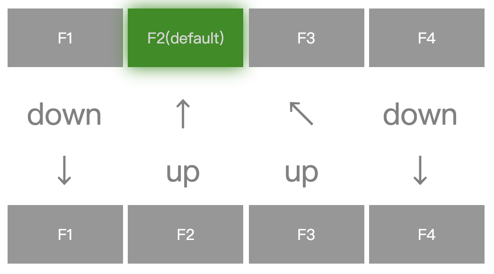

# PC端调试

### 介绍

在电视端进行网页开发调试相对繁琐，建议开发者先在PC端上进行开发调试，当网页项目的功能模块、UI布局及业务逻辑完成后再在电视上测试验收，这可显著提升开发效率。

<br/>

### 安装依赖

`npm install -S @ccos/ccsdk`

<br/>

### API

| 调用方法 | 功能说明 |
| :- | :- |
| <a href="#01" name="0_1"> ccDebug.setDeviceInfo </a> | 设置设备信息
| <a href="#02" name="0_2"> ccDebug.setUserInfo </a> | 设置用户信息
| <a href="#03" name="0_3"> ccDebug.setAccessToken </a> | 设置token信息
| <a href="#04" name="0_4"> ccDebug.setLoginStatus </a> | 设置登录信息
| <a href="#05" name="0_5"> ccDebug.setSystemAppVersion </a> | 设置系统应用版本
| <a href="#06" name="0_6"> ccDebug.getDeviceInfo </a> | 获取设备信息
| <a href="#07" name="0_7"> ccDebug.getUserInfo </a> | 获取用户信息
| <a href="#08" name="0_8"> ccDebug.getAccessToken </a> | 获取token信息
| <a href="#09" name="0_9"> ccDebug.getLoginStatus </a> | 获取登录信息
| <a href="#010" name="0_10"> ccDebug.getSystemAppVersion </a> | 获取系统应用版本

<br/>

## 焦点切换

### 介绍

电视端网页与移动端、PC端网页最大不同就是交互方式的区别，电视使用遥控器来操控，如何使网页元素之间能方便切换焦点变得非常重要，当开发的网页有元素焦点切换需求时，推荐开发者使用该插件，该插件又名`ccMap`插件。

::: warning 
不推荐开发者使用 `button、input` 等标签作为落焦元素，尽管浏览器内核会自动寻址这些标签元素，但不利于控制，也存在兼容性问题。推荐使用 `<div>` 标签作为落焦元素。
:::

<br/>

### 安装与环境依赖

- 直接下载并用`<script>`标签引入，[开发版本链接](https://beta.webapp.skysrt.com/fyb/other/cdn/ccmap-2.1.js)， ccMap会被注册为一个全局变量。在开始使用`ccmap.js`之前，请确保先引入`jQuery`：[下载链接](http://jquery.com/download/)

- 推荐使用脚手架工具`ccos-cli`，通过`import ccMap from @ccos/ccmap`使用插件

<br/>

### 特点

- ccMap为全局单例对象
- 支持链式调用
- 支持指定寻焦和自动寻焦
- 支持遥控器按键，鼠标点击和触屏多种交互
- 支持模拟数字按键输入【待实现】

<br/>

### API与使用

| 调用方法 | 功能说明 |
| :- | :- |
| <a href="#1" name="_1"> ccMap.init </a> | 初始化焦点，调用其他接口前必须先调用init
| <a href="#2" name="_2"> ccMap.reset </a> | 重置焦点
| <a href="#3" name="_3"> ccMap.setFocus </a> | 指定落焦元素
| <a href="#4" name="_4"> ccMap.add </a> | 添加需落焦元素
| <a href="#5" name="_5"> ccMap.remove </a> | 删除落焦元素
| <a href="#6" name="_6"> ccMap.setSupportTouch </a> | 设置是否支持触摸点击事件
| <a href="#7" name="_7"> ccMap.setSupportClick </a> | 设置是否支持鼠标点击事件【暂不支持】
| <a href="#8" name="_8"> ccMap.setDebugFlag </a> | 设置是否开启调试打印
| <a href="#9" name="_9"> ccMap.setOnKeydownListener </a> | 设置遥控器按键监听
| <a href="#10" name="_10"> ccMap.setFocusClass </a> | 设置元素落焦样式名称

<br/>
<br/>

<a name = "1" href="#_1"><font size=5>ccMap.init(目标元素组，落焦元素，落焦样式)</font></a>

__初始化焦点__
| 参数 | 类型 | 默认值 | 必填 | 说明 |
| :-: | :-: | :-: | :-: | :-: |
| 目标元素组 | `String` |  | 是 | 用同一class标识 |
| 落焦元素 | `String` | `''` | 否 | 用id或class标识，若不指定，插件会从目标元素组中自动指定 |
| 落焦样式 | `String` | `hover` | 否 | 自定义落焦样式名称 |


示例代码
```html
	<div id="container">
		<div id="first" class="coocaa_btn">元素一</div>
		<div id="second" class="coocaa_btn">元素二</div>
		<div id="third" class="coocaa_btn">元素三</div>
	</div>
```
```js
	ccMap.init(".coocaa_btn", '#second', "btn-focus")
```
<br/>

<a name = "2" href="#_2"><font size=5>ccMap.reset(目标元素组)</font></a>

__重置焦点__
| 参数 | 类型 | 默认值 | 必填 | 说明 |
| :-: | :-: | :-: | :-: | :-: |
| 目标元素组 | `String` |  | 是 | 用同一class标识 |

示例代码
```html
	<div id="container">
		<div id="first" class="coocaa_btn">元素一</div>
		<div id="second" class="coocaa_btn">元素二</div>
		<div id="third" class="coocaa_btn">元素三</div>
	</div>
	<div id="container">
		<div id="fourth" class="coocaa_btn2">元素四</div>
		<div id="fifth" class="coocaa_btn2">元素五</div>
		<div id="sixth" class="coocaa_btn2">元素六</div>
	</div>
```
```js
	ccMap.reset(".coocaa_btn2")
```
<br/>

<a name = "3" href="#_3"><font size=5>ccMap.setFocus(落焦元素)</font></a>

__指定落焦元素__
| 参数 | 类型 | 默认值 | 必填 | 说明 |
| :-: | :-: | :-: | :-: | :-: |
| 落焦元素 | `String` |  | 是 | 用id或class标识 |

示例代码
```html
	<div id="container">
		<div id="first" class="coocaa_btn">元素一</div>
		<div id="second" class="coocaa_btn">元素二</div>
		<div id="third" class="coocaa_btn">元素三</div>
	</div>
```
```js
	ccMap.setFocus("#third")
```
<br/>

<a name = "4" href="#_4"><font size=5>ccMap.add(目标元素)</font></a>

__添加需落焦元素__
| 参数 | 类型 | 默认值 | 必填 | 说明 |
| :-: | :-: | :-: | :-: | :-: |
| 目标元素 | `String` |  | 是 | 用id或class标识 |


示例代码
```html
	<div id="container">
		<div id="first" class="coocaa_btn">元素一</div>
		<div id="second" class="coocaa_btn">元素二</div>
		<div id="third" class="coocaa_btn">元素三</div>
	</div>
	<div id="fourth">元素四</div>
```
```js
	ccMap.init(".coocaa_btn", '#second', "btn-focus").add("#fourth")
```
<br/>

<a name = "5" href="#_5"><font size=5>ccMap.remove(目标元素)</font></a>

__删除落焦元素__
| 参数 | 类型 | 默认值 | 必填 | 说明 |
| :-: | :-: | :-: | :-: | :-: |
| 目标元素 | `String` |  | 是 | 用id或class标识 |


示例代码
```html
	<div id="container">
		<div id="first" class="coocaa_btn">元素一</div>
		<div id="second" class="coocaa_btn">元素二</div>
		<div id="third" class="coocaa_btn">元素三</div>
	</div>
```
```js
	ccMap.init(".coocaa_btn", '#second', "btn-focus").remove("#third")
```
<br/>

<a name = "6" href="#_6"><font size=5>ccMap.setSupportTouch(Boolean)</font></a>

__设置是否支持触摸点击事件__
| 参数 | 类型 | 默认值 | 必填 | 说明 |
| :-: | :-: | :-: | :-: | :-: |
|  开关 | `Boolean` | `true` | 否 | 默认支持触屏点击事件 |

示例代码
```html
	<div id="container">
		<div id="first" class="coocaa_btn">元素一</div>
		<div id="second" class="coocaa_btn">元素二</div>
		<div id="third" class="coocaa_btn">元素三</div>
	</div>
```
```js
	ccMap.init(".coocaa_btn", '#second', "btn-focus").setSupportTouch(false)
```
<br/>

<!-- <a name = "7" href="#_7"><font size=5>ccMap.setSupportClick(Boolean)</font></a>

__设置是否支持鼠标点击事件__
| 参数 | 类型 | 默认值 | 必填 | 说明 |
| :-: | :-: | :-: | :-: | :-: |
|  开关 | `Boolean` | `false` | 否 | 默认不支持鼠标点击事件 |

示例代码
```html
	<div id="container">
		<div id="first" class="coocaa_btn">元素一</div>
		<div id="second" class="coocaa_btn">元素二</div>
		<div id="third" class="coocaa_btn">元素三</div>
	</div>
```
```js
	ccMap.init(".coocaa_btn", '#second', "btn-focus").setSupportClick(true)
```
<br/> -->

<a name = "8" href="#_8"><font size=5>ccMap.setDebugFlag(Boolean)</font></a>

__设置是否开启调试打印__
| 参数 | 类型 | 默认值 | 必填 | 说明 |
| :-: | :-: | :-: | :-: | :-: |
|  开关 | `Boolean` | `true` | 否 | 可以查看插件内打印信息 |


示例代码
```js
	ccMap.setDebugFlag(false)
```
<br/>

<a name = "9" href="#_9"><font size=5>ccMap.setOnKeydownListener(Function)</font></a>

__设置遥控器按键监听__
| 参数 | 类型 | 默认值 | 必填 | 说明 |
| :-: | :-: | :-: | :-: | :-: |
|  参数 | `Function` |  | 是 | 监听遥控器按键事件 |


示例代码
```js
	ccMap.setOnKeydownListener(function (e) {
		console.log(e)
	})
```
<br/>

<a name = "10" href="#_10"><font size=5>ccMap.setFocusClass(String)</font></a>

__设置元素落焦样式名称__
| 参数 | 类型 | 默认值 | 必填 | 说明 |
| :-: | :-: | :-: | :-: | :-: |
|   | `String` |  | 是 | 设置自定义样式class名称 |


示例代码
```css
	.btn-focus {
		color: #ff0000;
	}
```
```js
	ccMap.init(".coocaa_btn", '#second', "btn-focus")
```

<br/>

### 指定落焦使用

```html
	<div class="main">
		<div id="f1" class="item coocaa_btn" downTarget="#subf1" rightTarget="#f2" upTarget="#" leftTarget="#">F1</div>
		<div id="f2" class="item coocaa_btn" downTarget="#" rightTarget="#f3" upTarget="#" leftTarget="#f1">F2(default)</div>
		<div id="f3" class="item coocaa_btn" downTarget="#" rightTarget="#f4" upTarget="#" leftTarget="#f2">F3</div>
		<div id="f4" class="item coocaa_btn" downTarget="#subf4" rightTarget="#" upTarget="#" leftTarget="#f3">F4</div>
	</div>

	<div class="nav">
		<div class="item">down<br />↓</div>
		<div class="item">↑<br />up</div>
		<div class="item">↖<br />up</div>
		<div class="item">down<br />↓</div>
	</div>

	<div class="sub">
		<div id="subf1" class="item coocaa_btn" downTarget="#" rightTarget="#subf2" upTarget="#" leftTarget="#">F1</div>
		<div id="subf2" class="item coocaa_btn" downTarget="#" rightTarget="#subf3" upTarget="#f2" leftTarget="#subf1">F2</div>
		<div id="subf3" class="item coocaa_btn" downTarget="#" rightTarget="#subf4" upTarget="#f2" leftTarget="#subf2">F3</div>
		<div id="subf4" class="item coocaa_btn" downTarget="#" rightTarget="#sub" upTarget="#" leftTarget="#subf3">F4</div>
	</div>
```
```js
	ccMap.init(".coocaa_btn", "#f2", "btn-focus")
```


<br/>
<br/><br/><br/><br/><br/><br/><br/>

<Block>
</Block>

<Block>
__重置焦点元素: ccMap.reset(目标元素)__

```html
<div id="container">
	<div id="first" class="coocaa_btn">第一组#1</div>
	<div id="second" class="coocaa_btn">第一组#2</div>
</div>
<div id="container2">
	<div id="first2" class="coocaa_btn2">第二组#1</div>
	<div id="second2" class="coocaa_btn2">第二组#2</div>
</div>
```
```js
ccmap.init(".coocaa_btn", '#second', "btn_class")
    .reset('.coocaa_btn2');
```


指定元素落焦可以提升焦点切换速度

<Example>
<br/>
<br/>
<br/>
<br/>
效果：

<!--  -->


</Example>

</Block>


<br/>
<br/>
<br/>
<br/>
<br/>

## CCSDK Lite版

### API 调用说明

所有 API 通过`_liteNativeApi`对象来调用，在页面`window.onload`后使用。

| 调用方法 | 功能说明 |
| :- | :- |
| <a href="#1-1" name="_1-1"> _liteNativeApi.start </a> | 跳转其他页面
| <a href="#1-2" name="_1-2"> _liteNativeApi.check </a> | 检测应用是否存在,如存在可获取版本信息
| <a href="#1-3" name="_1-3"> _liteNativeApi.getInfo </a> | 获取设备信息
| <a href="#1-4" name="_1-4"> _liteNativeApi.getProperties </a> | 获取系统属性
| <a href="#1-5" name="_1-5"> _liteNativeApi.exit </a> | 退出当前页面
| <a href="#1-6" name="_1-6"> _liteNativeApi.exitAll </a> | 退出所有页面

## 在线运行

## Vue与ccsdk

## Vue与ccmap

<br/>
<br/>
<br/>
<br/>
<br/>


<Block>

## CURL 组件

`CURL` 组件是一个非常有用的组件。主要用于在编写 API 时更好的显示 `curl` 命令时使用。

例如下面的内容将会渲染成右侧的形式：

````vue
<CURL>
```bash
curl -X POST http://api.example.com/api/auth/login \
  --data '{
    "username": "my-username",
    "password": "my-password"
  }'
```
</CURL>
````

`CURL` 组件会在组件下方自动生成一个按钮，当点击按钮时，会通过分析 `curl` 命令内的参数，通过 `JS` 发送请求到对应的地址上。并将其请求信息输出到浏览器开发者工具中的控制台上。方便进行快速测试和预览。

<Example>

<CURL>

```bash
curl -X POST http://api.example.com/api/auth/login \
  --data '{
    "username": "my-username",
    "password": "my-password"
  }'
```
</CURL>

</Example>

</Block>

